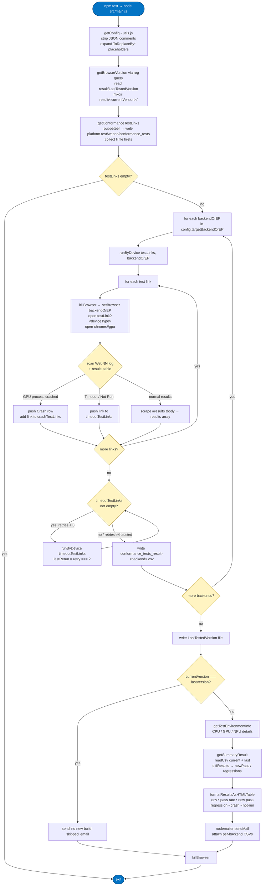

This test infrastructure is to run WPT WebNN Conformance tests by
Chrome Canary on Windows11 platform, and send test report mail.

### Dependency
- Node.js

Download and install the latest [Node.js LTS release](https://nodejs.org/en/download).

- Chrome Canary

Download and install the latest [Chrome
Canary](https://www.google.com/chrome/canary/).

- Optional Install Windows App SDK & Install Execution Providers via the EP Catalog executable file for testing ORT EPs.

Please follow https://webnn.io/en/learn/get-started/installation#run-webnn-on-windows-ml-backend-cpu-gpu-and-npu.

Note: Do not install Execution Providers if you want to test ORT default CPU, GPU (DirectML) or ORT WebGPU EP.

### Precondition A - Testing with own built ONNXRuntime and OpenVino EP dlls
Prepare for target ONNXRuntime libraries and ONNXRuntime OpenVino EP
libraries, then follow below two steps.

Step 1: Make a directory named "ONNXRuntime" under %ProgramFiles%, then
copy below ONNXRuntime libraries into it.
```
onnxruntime.dll
onnxruntime_providers_shared.dll
```

Step 2: Make a directory named "ONNXRuntime-OVEP" under %ProgramFiles%, then
copy below 
dependent OpenVino EP libraries into it.
```
onnxruntime_providers_openvino_plugin.dll
openvino.dll
openvino_intel_cpu_plugin.dll (for CPU inference)
openvino_intel_gpu_plugin.dll (for GPU inference)
openvino_intel_npu_plugin.dll (for NPU inference)
openvino_onnx_frontend.dll (for converting ONNX model to OpenVINO IR)
tbb12.dll (dependency of openvino.dll)
```

### Precondition B - Testing with own built ONNXRuntime and WebGPU EP dlls
Step1: Build ONNXRuntime WebGPU EP.

Step2: Make a directory named "ONNXRuntime" under %ProgramFiles%, then
copy below ONNXRuntime libraries into it.
```
onnxruntime.dll
onnxruntime_providers_shared.dll
```

### Installing
```batch
> git clone https://github.com/BruceDai/test-wpt-webnn
> cd test-wpt-webnn
> npm install
```

### Configure settings in config.json
Please modify settings in config.json.<br>
Please modify settings in config_customEP.json and rename it as config.json if you want to test your custom EP.

### Running Test
```batch
npm test
```

### Execution Flow

